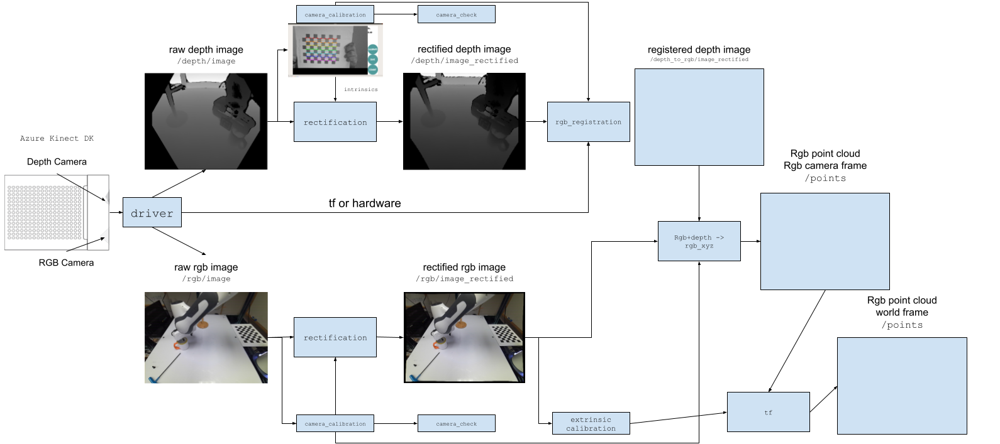

# Camera Calibration Handbook

A spectre is is haunting robotics - the spectre of calibration.

In this repository, we're gonna focus on

## Overview

[Drive Link](https://docs.google.com/drawings/d/1KTcM1QniX58rSm84I1FFqzv54V7orZXqCRdcAiAHqxo/edit)

## Intrinsics

Note: stock intrinsics on the Kinect are OK - not great, not terrible. However, slight inaccuracies in the calibration cause issues, in particular color bleeding and non-planar surfaces...

Known issue: depth-to-rgb

Check k4aviewer

### RGB Camera

### IR Camera

## Validating Intrinsics

## Extrinsics

### Manual

#### Independent Calibration

#### Calibration adjustment

### easy_handeye

### moveit_calibration

TODO: not really supported...

### Polymetis

### Kalibr

### Idealized Joint Calibration Setup...

## Validating Extrinsics

### Single Camera

### Multi-Camera

Possible future options:
* Perform calibration from rgb_to_depth. The justification here is that if we calibrate to the depth camera's frame, then the error profile will be better aligned with our downstream output (good point clouds). However, it's a bit spotty visually, so apriltags may not be visualized properly.

https://calib.io/blogs/knowledge-base/camera-models

https://rosindustrial.org/3d-camera-survey

